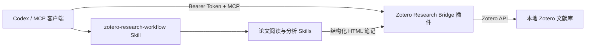

# Zotero Research Bridge 项目说明

## 1. 项目定位

Zotero Research Bridge 是一套开源、本地优先的 Zotero 科研文献自动化基础设施。它让 Codex 等支持 MCP 的 AI 客户端能够读取和管理本地 Zotero 文献库，而不需要模拟鼠标键盘，也不需要直接修改 `zotero.sqlite`。

它把以下环节连接为一条可重复、可审计的流程：

1. 将论文 PDF 保存到 Zotero；
2. 查询文献、附件、文件夹、标签、批注和全文；
3. 按研究主题、研究项目和阅读状态整理文献；
4. 调用论文分析 Skill 阅读完整 PDF；
5. 将结构化分析保存为对应文献下的 Zotero 子笔记；
6. 在必要时安全地修改、移入回收站或恢复条目。

项目主要服务于机器学习、深度学习、动态图、时序知识图谱和链路预测等科研场景，但底层能力并不局限于这些领域。

## 2. 代码来源与组成

本项目不是完全从零开发。它基于 MIT 许可的 [`lricher7329/zotero-mcp-claude-code` v1.8.6](https://github.com/lricher7329/zotero-mcp-claude-code) 二次开发，并保留上游版权与许可声明。

上游主要提供：

- Zotero 插件生命周期和设置界面；
- MCP Streamable HTTP 协议；
- 文献、文件夹、批注与全文检索；
- PDF 内容提取；
- 语义索引相关基础模块；
- 插件构建和测试框架。

本项目主要新增或强化：

- 仅本机回环监听和强制 Bearer Token 鉴权；
- 分范围写入权限；
- `plan_mutation` → `apply_mutation` 两阶段写入；
- 可恢复的增删改操作；
- 审计日志和敏感信息脱敏；
- 正式 Zotero 运行时兼容修复；
- 隔离集成测试；
- 完整的科研文献处理 Skill。

仓库是一个 Git 仓库，不包含 Git submodule：

```text
zotero-research-bridge/
├── zotero-mcp-plugin/          上游插件基础 + 本项目安全写入改造
├── zotero-research-workflow/   本项目的 Codex 科研工作流 Skill
├── .github/workflows/          CI 与公开 Release 流程
├── README.md                   英文项目入口
├── PROJECT_OVERVIEW.zh-CN.md   中文项目说明
├── CONTRIBUTING.md             贡献指南
├── SECURITY.md                 安全策略
└── CHANGELOG.md                版本记录
```

## 3. 系统架构



两个核心组件的职责不同：

- `zotero-mcp-plugin/` 负责底层读取、写入和安全边界；
- `zotero-research-workflow/` 负责把底层能力组织成稳定的科研流程。

插件解决“能不能安全操作 Zotero”，工作流解决“应该按什么顺序处理文献”。

## 4. 功能范围

### 4.1 查询和读取

- 搜索 Zotero 文献库；
- 查看题录、作者、摘要、标签和文件夹；
- 查询 PDF 附件并提取全文；
- 查看高亮、批注和已有笔记；
- 查询文件夹层级和文件夹内条目；
- 执行全文检索。

### 4.2 新增和修改

- 创建文献条目、文件夹和子笔记；
- 导入本地 PDF 或开放获取的网络 PDF；
- 更新题录元数据；
- 添加或移除标签；
- 将同一文献加入多个文件夹；
- 更新带有系统标记的分析笔记；
- 建立相关文献关系。

### 4.3 删除和恢复

- 将条目移入 Zotero 回收站；
- 从回收站恢复条目；
- 执行经过数量限制的批量操作。

项目有意不提供永久删除条目、清空回收站、永久删除文件夹和全库删除标签等不可恢复操作。

## 5. 典型文献流程

1. 从 PDF 识别题目、作者、年份、期刊或会议、DOI 和摘要；
2. 先按 DOI、再按规范化题目查询 Zotero，避免重复；
3. 如果条目不存在，创建父条目并导入 PDF；
4. 按研究主题加入一至三个叶子文件夹，同时保留研究项目和阅读状态；
5. 使用论文分析 Skill 阅读实际 PDF，而不是只分析摘要；
6. 生成包含研究问题、方法、公式、实验、结果、贡献、局限和复现条件的笔记；
7. 将笔记作为子笔记写回父条目；
8. 回读 Zotero 条目并检查审计日志。

系统生成的分析笔记带有版本标记，例如：

```text
ZRB_ANALYSIS_V1:structured-analysis
```

更新笔记前会查找相同标记。只有同类系统笔记才会被更新，人工笔记不会被覆盖。

## 6. 安全设计

- MCP 服务只监听 `127.0.0.1`，默认端口为 `23121`；
- MCP 和所有写入请求必须通过 Bearer Token 验证；
- 写权限按元数据、笔记、标签、文件夹、导入、删除和批量操作分别控制；
- 所有写入均采用有时限、一次性的两阶段协议；
- 高风险计划需要针对具体目标重新确认；
- 审计日志隐藏笔记正文、元数据值和本地源目录；
- 不执行任意 JavaScript，不直接写入 `zotero.sqlite`，不直接改动 Zotero 存储目录。

Token 属于敏感信息，不应写入仓库、日志、文档、Issue 或命令输出。

## 7. 开发目录、安装目录和运行副本

### 7.1 开发源代码

克隆仓库后，将仓库根目录记为：

```text
<repo>/zotero-research-bridge
```

所有开发、测试、版本管理和打包都应从源代码仓库开始。

### 7.2 Zotero 安装副本

正式安装位置取决于操作系统、Zotero Data Directory 和 Profile。开发源代码与 Zotero 正在运行的安装副本相互独立：修改源码不会自动更新已经安装的插件，必须重新构建并安装 XPI。

不要直接在 Zotero 的正式安装目录中长期修改代码，否则运行版本与 Git 历史会失去对应关系。

### 7.3 Codex Skill 安装副本

仓库内的 `zotero-research-workflow/` 是可维护源文件。Codex 通常从下面的位置加载安装副本：

```text
$CODEX_HOME/skills/zotero-research-workflow
```

如果没有设置 `CODEX_HOME`，常见位置是：

```text
$HOME/.codex/skills/zotero-research-workflow
```

修改工作流后，需要同步安装副本并重新验证。

### 7.4 审计日志

审计日志默认保存在 Zotero Data Directory 下：

```text
<Zotero.DataDirectory>/zotero-research-bridge/mutation-audit.jsonl
```

## 8. 开发与测试

```bash
git clone https://github.com/z-jjj-y/zotero-research-bridge.git
cd zotero-research-bridge/zotero-mcp-plugin
npm ci
npm run test:unit
npm run build
npm run lint:check
```

隔离集成测试使用测试 Profile 和测试数据，不应直接对个人 Zotero 文献库运行：

```bash
ZOTERO_PLUGIN_ZOTERO_BIN_PATH=/Applications/Zotero.app/Contents/MacOS/zotero \
  npm test -- --no-watch --exit-on-finish
```

验证工作流 Skill：

```bash
cd /path/to/zotero-research-bridge
uv run --with pyyaml python \
  ~/.codex/skills/.system/skill-creator/scripts/quick_validate.py \
  zotero-research-workflow
```

构建产物位于：

```text
zotero-mcp-plugin/.scaffold/build/zotero-research-bridge.xpi
```

## 9. 发布与更新

推送符合 `vX.Y.Z` 格式的标签后，根目录下的 GitHub Actions Release 工作流会重新运行测试、静态检查和生产构建，然后发布 XPI 与 SHA-256 校验文件。

v0.1.0 暂不启用 Zotero 自动更新。用户应从本仓库 GitHub Releases 下载经过审查的 XPI，并手动安装升级。原因和后续启用条件见 `AUTO_UPDATE_GUIDE.md`。

## 10. Git 远程关系

推荐保持两个远程：

```text
origin   https://github.com/z-jjj-y/zotero-research-bridge.git
upstream https://github.com/lricher7329/zotero-mcp-claude-code.git
```

- `origin` 用于本项目的提交、Issue、Pull Request 和 Release；
- `upstream` 只用于获取上游开源项目的新版本；
- 上游更新应在独立分支中合并，并完整回归鉴权、权限、两阶段写入和审计脱敏。

## 11. 当前版本

- 项目版本：`0.1.0`
- 插件标识：`zotero-research-bridge@local.litzeng`
- 上游基础：`lricher7329/zotero-mcp-claude-code` v1.8.6
- 目标 Zotero：9.0.x
- 已验证：121 项单元测试和 2 项隔离集成测试
- 已验证实机闭环：查询 PDF、读取全文、生成论文分析、写回子笔记并回读确认

## 12. 维护原则

- 不提交 Token、API Key、Zotero Profile、个人文献库、PDF 或审计日志；
- 不丢弃上游 MIT 许可和来源声明；
- 发布前必须通过测试、构建、静态检查和敏感信息扫描；
- Zotero 或 MCP 协议升级后应重新执行完整测试；
- 生产库验证只使用专门的可恢复测试条目；
- 任何高风险写入都应保持显式确认和可审计性。
